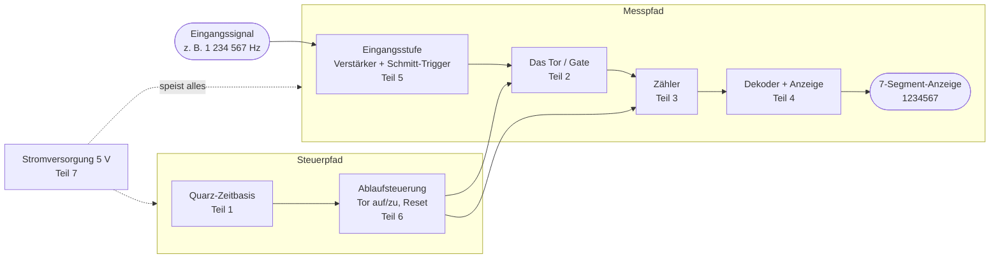

# Frequenzzähler – ein Tutorial von Grund auf

!!! abstract "Worum geht es hier?"
    Wir bauen gemeinsam einen **digitalen Frequenzzähler** – ein Gerät, das misst,
    wie oft ein elektrisches Signal pro Sekunde schwingt, und das Ergebnis als Zahl
    anzeigt. Du brauchst **keine Vorkenntnisse** über Digitaltechnik. Wir beginnen bei
    der Frage „Was ist Frequenz überhaupt?" und enden bei einer vollständig
    verstandenen, nachbaubaren Schaltung.

## Für wen ist dieses Tutorial?

Für Studierende und Hobbyisten mit **geringer Elektrotechnik-Erfahrung**. Wenn du
weißt, was Spannung, Strom und ein Widerstand ungefähr sind, reicht das als Start.
Alles andere – Logikgatter, Zähler, Quarzoszillatoren, Siebensegmentanzeigen –
erklären wir Schritt für Schritt und von Grund auf.

## Das Lernprinzip: verstehen → simulieren → stecken → löten

Wir bauen den Zähler **nicht** in einem Rutsch zusammen. Stattdessen zerlegen wir ihn
in Baugruppen und nehmen uns jede einzeln vor. Für jede Baugruppe gilt derselbe
Viertakt:

1. **Verstehen** – Was soll dieser Block tun und warum? Mit Theorie und Formel.
2. **Simulieren** – Den Block am Rechner ausprobieren (Falstad, LTspice, Logisim),
   bevor ein einziges Bauteil gekauft wird. Fehler kosten hier nur einen Mausklick.
3. **Stecken** – Den Block auf dem Steckbrett (Breadboard) aufbauen und **messen**.
4. **Löten** – Erst ganz am Ende, wenn alles verstanden und geprüft ist.

!!! tip "Warum dieser Umweg über Simulation und Steckbrett?"
    Ein fertig gelöteter, nicht funktionierender Aufbau ist für Einsteiger extrem
    frustrierend, weil man nicht weiß, *wo* der Fehler steckt. Wenn du jede Baugruppe
    einzeln verstehst und misst, weißt du am Ende **genau**, was jedes Bauteil tut –
    und Fehlersuche wird zur Routine statt zum Ratespiel.

## Das Ziel: so sieht der fertige Zähler innen aus

Jeder digitale Frequenzzähler besteht aus denselben Grundbausteinen. Hier das
Gesamtbild, das wir Kapitel für Kapitel mit Leben füllen:



In Worten: Das **Eingangssignal** wird zunächst sauber in eine Rechteckform gebracht
(Eingangsstufe). Dann lässt ein **Tor** die Schwingungen genau für eine exakt bekannte
Zeitspanne – die **Torzeit** – zum **Zähler** durch. Woher diese exakte Zeit kommt,
bestimmt die **Quarz-Zeitbasis**. Eine **Ablaufsteuerung** öffnet und schließt das Tor
und setzt den Zähler zurück. Das Zählergebnis wird schließlich dekodiert und auf der
**Anzeige** dargestellt. Alles zusammen versorgt die **Stromversorgung**.

## Die beiden Vorlagen

Dieses Tutorial stützt sich auf zwei bewährte, real existierende Schaltungen:

=== "BX-020 (unser roter Faden)"

    Der **45-MHz-Frequenzzähler** aus dem FUNKAMATEUR-Leserservice (Box 73, Entwurf
    K. Raban, DG2XK) ist ein Musterbeispiel für das **direkte Zählverfahren**. Er
    besteht aus wenigen, klar getrennten Baugruppen mit klassischen Logik-ICs
    (74HC-Serie und 4026). Genau deshalb ist er ideal zum **Lernen**: jeder Block ist
    sichtbar und einzeln begreifbar.

    | Baugruppe | Bauteil | Tutorial-Teil |
    |-----------|---------|---------------|
    | Eingangsstufe | T1 (SF245) | Teil 5 |
    | Vorteiler 10:1 | 74HC4017 | Teil 3 |
    | Zeitbasis | 3,2768 MHz + 74HC4060 + 74HC74 | Teil 1 |
    | Zähler + Dekoder | 5× 4026 | Teil 3 / 4 |
    | Anzeige | 5× 7-Segment | Teil 4 |
    | Versorgung | 7805 | Teil 7 |

    Seine **Schwächen** (flimmernde Anzeige, nur 1 kHz Auflösung) sind kein Mangel,
    sondern **Lernchancen**: An ihnen erklären wir in Teil 6 und 9, warum „erwachsene"
    Zähler einen Zwischenspeicher (Latch) brauchen.

=== "Elektor-Niederfrequenzzähler (Weiterführung)"

    Der NF-Zähler aus Elektor zeigt die **verbesserte** Lösung: Der Baustein
    **74C925** vereint Zähler, **Zwischenspeicher (Latch)**, Multiplexer und
    7-Segment-Dekoder in einem IC – dadurch steht die Anzeige **flimmerfrei**. Die
    Zeitbasis liefert ein integrierter Taktgenerator (Seiko-Epson SPG8650B). Diese
    Konzepte greifen wir in **Teil 9** auf.

## Was du brauchst

!!! note "Nur zum Lesen & Simulieren"
    Ein Rechner genügt. Alle Simulationen laufen kostenlos (Falstad sogar im Browser).

!!! note "Zum echten Aufbau (optional, Teil 8)"
    Steckbrett, die Bauteile aus der [Bauteilliste](anhang-bom.md), ein einfaches
    **Multimeter** und – fürs Löten – ein kleiner Lötkolben. Ein Oszilloskop ist
    schön, aber **nicht** zwingend; wir zeigen auch Messungen nur mit dem Multimeter.

## Die Toolchain dieses Projekts (für Autoren/Mitschreibende)

Diese Website ist mit **MkDocs Material** gebaut. Lokale Vorschau:

```bash
pip install -r requirements.txt
python -m mkdocs serve      # öffnet http://127.0.0.1:8000
python -m mkdocs build      # erzeugt die statische Site in site/
```

Die Simulator-Projektdateien liegen unter `sim/` und sind im Anhang
[Simulator-Dateien](anhang-simulation.md) erklärt und verlinkt.

---

**Bereit?** Dann geht es los mit [Teil 0 – Grundlagen](teil-0-grundlagen.md): Was ist
Frequenz, und wie kann man sie überhaupt zählen?
