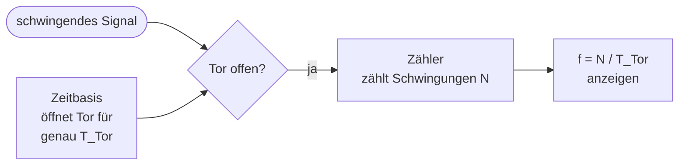

# Teil 0 – Grundlagen: Was ist Frequenz, und wie zählt man sie?

!!! abstract "Ziel dieses Teils"
    Nach diesem Kapitel verstehst du, **was Frequenz physikalisch bedeutet**, kennst
    das **grundlegende Zählverfahren** eines Frequenzzählers und kannst die wichtigste
    Formel des ganzen Tutorials – \( f = N / T_\text{Tor} \) – selbst anwenden. Außerdem
    weißt du, warum unser Zähler eine **Auflösungsgrenze** hat.

## 1. Frequenz und Periode

Viele elektrische Signale **schwingen**: Ihre Spannung steigt und fällt immer wieder im
selben Muster. Ein Lautsprecherton, ein Funksignal, der Takt in einem Computer – alles
schwingt. Zwei Begriffe beschreiben diese Schwingung:

- Die **Periodendauer** \( T \) ist die Zeit für **eine** vollständige Schwingung
  (Einheit: Sekunde, s).
- Die **Frequenz** \( f \) ist die **Anzahl der Schwingungen pro Sekunde**
  (Einheit: Hertz, Hz). 1 Hz = „eine Schwingung pro Sekunde".

Beide hängen über einen einfachen Kehrwert zusammen:

\[
f = \frac{1}{T} \qquad\Longleftrightarrow\qquad T = \frac{1}{f}
\]

!!! example "Zahlenbeispiel"
    Eine Schwingung dauert \( T = 1\,\text{ms} = 0{,}001\,\text{s} \). Dann ist
    \[
    f = \frac{1}{0{,}001\,\text{s}} = 1000\,\text{Hz} = 1\,\text{kHz}.
    \]
    Umgekehrt: Der Kammerton a hat \( f = 440\,\text{Hz} \), also dauert eine
    Schwingung \( T = 1/440\,\text{s} \approx 2{,}27\,\text{ms} \).

So sieht eine schwingende Spannung über der Zeit aus (ein Rechtecksignal, wie es in der
Digitaltechnik üblich ist):

```
Spannung
  5V ┤   ┌───┐   ┌───┐   ┌───┐   ┌───┐
     │   │   │   │   │   │   │   │   │
  0V ┤───┘   └───┘   └───┘   └───┘   └──►  Zeit
     │   ├───────┤
     │   eine Periode T
     └── in 1 Sekunde passen f solcher Perioden
```

Gebräuchliche Vielfache von Hertz – die begegnen uns ständig:

| Einheit | Bedeutung | Größenordnung |
|---------|-----------|---------------|
| 1 Hz    | 1 Schwingung/s | Herzschlag-Bereich |
| 1 kHz   | 1 000 Hz | hörbarer Ton |
| 1 MHz   | 1 000 000 Hz | Mittelwellen-Radio |
| 1 GHz   | 1 000 000 000 Hz | Handy, WLAN, CPU-Takt |

## 2. Die Grundidee: Frequenz heißt Zählen

Die Definition „Schwingungen **pro Sekunde**" ist bereits die komplette Bauanleitung für
einen Frequenzzähler. Wir müssen nur zwei Dinge tun:

1. Ein **Zeitfenster** mit **exakt bekannter Dauer** öffnen – wir nennen es die
   **Torzeit** \( T_\text{Tor} \) (engl. *gate time*).
2. **Zählen**, wie viele Schwingungen \( N \) in diesem Fenster vorbeikommen.

Daraus ergibt sich die Frequenz:

\[
\boxed{\,f = \dfrac{N}{T_\text{Tor}}\,}
\]

Das ist die **wichtigste Formel des gesamten Tutorials**. Fast jede Baugruppe, die wir
bauen, dient dazu, einen Teil dieser Gleichung zu verwirklichen.



!!! example "Rechnen wir es durch"
    Wir öffnen das Tor für **genau 1 Sekunde** (\( T_\text{Tor} = 1\,\text{s} \)) und
    zählen dabei **1000** Schwingungen (\( N = 1000 \)):
    \[
    f = \frac{1000}{1\,\text{s}} = 1000\,\text{Hz} = 1\,\text{kHz}.
    \]
    Praktischer Nebeneffekt: Bei genau **1 Sekunde** Torzeit ist das Zählergebnis
    \( N \) **direkt** die Frequenz in Hz. Der Zähler muss gar nicht rechnen – er zeigt
    einfach seinen Zählerstand an. Das ist der Grund, warum eine 1-s-Torzeit so beliebt
    ist.

## 3. Die Torzeit bestimmt die Auflösung

Ein digitaler Zähler kann nur **ganze** Schwingungen zählen – 0, 1, 2, 3 … niemals 2,7.
Was aber, wenn genau am Ende des Zeitfensters eine Schwingung „halb fertig" ist? Dann
zählt der Zähler sie entweder ganz oder gar nicht. Dadurch ist das Ergebnis immer mit
einer **Unsicherheit von ±1 Zählschritt** (±1 Digit) behaftet – das ist unvermeidbar und
heißt **Quantisierungsfehler**.

Wie groß dieser ±1-Digit-Fehler *in Hertz* ist, hängt allein an der Torzeit:

\[
\text{Auflösung} = \frac{1}{T_\text{Tor}}
\]

| Torzeit \( T_\text{Tor} \) | Auflösung (±1 Digit entspricht) | Messdauer |
|----------------------------|---------------------------------|-----------|
| 1 s      | 1 Hz    | langsam, aber genau |
| 0,1 s    | 10 Hz   | |
| 10 ms    | 100 Hz  | schnell, aber grob |
| 1 ms     | 1000 Hz | sehr grob |

!!! warning "Der zentrale Zielkonflikt"
    **Längere Torzeit = feinere Auflösung, aber langsamere Messung.** Kürzere Torzeit =
    schnellere Anzeige, aber gröbere Auflösung. Diesen Kompromiss trifft **jeder**
    Frequenzzähler. Unser BX-020-Vorbild nutzt eine sehr kurze Torzeit von nur 10 ms –
    deshalb hat es die grobe Auflösung von 1 kHz. **Warum** es trotzdem so gebaut ist,
    klären wir in Teil 6 (Stichwort: fehlender Zwischenspeicher).

## 4. Ein Trick für hohe Frequenzen: der Vorteiler

Zähler-ICs können nicht beliebig schnell zählen. Ein 4026 schafft bei 5 V nur etwa
2,5 MHz. Wie misst man dann 45 MHz? Man schaltet einen **Vorteiler** (engl.
*prescaler*) vor den Zähler, der die Frequenz z. B. durch 10 teilt. Der Zähler sieht nur
noch ein Zehntel der Frequenz und kommt mit.

Natürlich muss man den Faktor 10 wieder „hereinrechnen". Das geschieht elegant durch
Anpassen der Torzeit – bei unserem Vorbild übernimmt genau diese Rolle die Kombination
aus 10:1-Vorteiler und 10-ms-Torzeit. Die Details folgen in Teil 3.

!!! note "Kurz gesagt"
    Vorteiler = „Gib dem langsamen Zähler eine langsamere Version des Signals, und
    korrigiere den Faktor an anderer Stelle." Kein Verlust an Genauigkeit, aber Zugang
    zu viel höheren Frequenzen.

## 5. Zwei Messverfahren (Ausblick)

Es gibt zwei grundsätzliche Wege, Frequenz zu messen. Wir bauen zuerst das erste und
lernen das zweite in Teil 9 kennen:

=== "Direkte Zählung (unser Hauptweg)"

    Zähle die Schwingungen des Signals während einer festen Torzeit:
    \( f = N / T_\text{Tor} \). **Ideal für hohe Frequenzen.** Bei niedrigen Frequenzen
    wird es ungenau – bei 50 Hz und 1 s Tor zählt man nur 50 Schwingungen, der
    ±1-Digit-Fehler sind dann gleich 2 %.

=== "Perioden-/Reziprok-Messung (Teil 9)"

    Drehe den Spieß um: Miss die **Dauer einer Periode** mit einem schnellen
    Referenztakt und rechne \( f = 1/T \). **Ideal für niedrige Frequenzen**, weil man
    dort viele Referenztakt-Impulse pro Signalperiode zählt und so hohe Auflösung
    erreicht. Genau deshalb nutzt der Elektor-NF-Zähler ein anderes Konzept als unser
    BX-020.

## 6. Unser Werkzeugkasten

Bevor wir echte Bauteile anfassen, probieren wir jede Baugruppe am Rechner aus. Diese
drei kostenlosen Werkzeuge begleiten uns:

| Werkzeug | Wofür | Warum gut für Einsteiger |
|----------|-------|--------------------------|
| **Falstad / CircuitJS** | Analog **und** Logik, direkt im Browser | Null Installation, man *sieht* Ströme und Pegel fließen |
| **LTspice** | genaue Analog-Simulation (Eingangsstufe) | Industriestandard, kostenlos, sehr genau |
| **Logisim Evolution / Digital** | reine Logik (Zähler, Teiler) | zeigt Digitaltechnik anschaulich mit „Schaltern und Lampen" |

Die fertigen Projektdateien zu jedem Kapitel findest du im Anhang
[Simulator-Dateien](anhang-simulation.md) – du musst nichts von Grund auf selbst
aufbauen, kannst aber alles verändern und damit experimentieren.

## Zusammenfassung

- **Frequenz** = Schwingungen pro Sekunde; \( f = 1/T \).
- Ein Frequenzzähler **zählt** Schwingungen in einem Zeitfenster: \( f = N / T_\text{Tor} \).
- Die **Torzeit** bestimmt die **Auflösung** (\( 1/T_\text{Tor} \)) und steht im
  Zielkonflikt mit der Messgeschwindigkeit.
- Es gibt immer einen **±1-Digit-Fehler** (Quantisierung).
- Ein **Vorteiler** macht hohe Frequenzen für langsame Zähler messbar.

## Übungsfragen

??? question "1. Ein Zähler zählt in 0,5 s genau 2500 Schwingungen. Wie hoch ist die Frequenz?"
    \( f = N / T_\text{Tor} = 2500 / 0{,}5\,\text{s} = 5000\,\text{Hz} = 5\,\text{kHz} \).

??? question "2. Du willst 1 Hz Auflösung. Wie lang muss die Torzeit mindestens sein?"
    Auflösung \( = 1/T_\text{Tor} \). Für 1 Hz: \( T_\text{Tor} = 1\,\text{s} \).

??? question "3. Warum ist direkte Zählung bei 50 Hz eine schlechte Idee?"
    Mit 1 s Tor zählt man nur 50 Schwingungen. Der unvermeidbare ±1-Digit-Fehler ist
    dann \( 1/50 = 2\,\% \) – viel zu grob. Hier gewinnt die Periodenmessung (Teil 9).

---

Weiter mit [Teil 1 – Die Zeitbasis](teil-1-zeitbasis.md): Wie erzeugt man eine
*exakt* bekannte Torzeit? Antwort: mit einem Quarz und ein paar Teiler-ICs.
