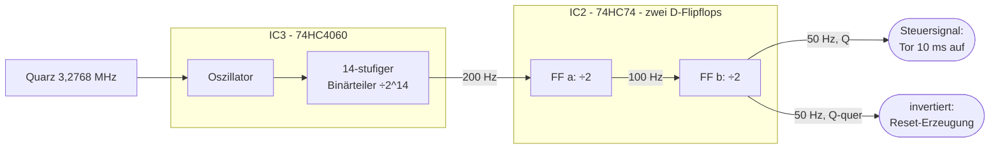

# Teil 1 – Die Zeitbasis: eine exakt bekannte Zeit erzeugen

!!! abstract "Ziel dieses Teils"
    In Teil 0 haben wir gesehen: Der Zähler braucht ein Zeitfenster mit **exakt
    bekannter Dauer** (die Torzeit). „Exakt" ist das Schlüsselwort – jede Ungenauigkeit
    der Zeit geht **1:1** in den Messwert ein. Hier lernst du, wie man mit einem
    **Quarz** und zwei **Teiler-ICs** aus einer hohen, stabilen Frequenz ein
    präzises 50-Hz-Steuersignal macht.

## 1. Warum überhaupt ein Quarz?

Erinnere dich an die zentrale Formel \( f = N / T_\text{Tor} \). Das Messergebnis ist nur
so genau wie die Torzeit. Ein Beispiel macht das drastisch klar:

!!! warning "Was ein ungenauer Takt anrichtet"
    Angenommen, unsere Torzeit ist um 1 % zu lang. Dann zählt der Zähler 1 % zu viele
    Schwingungen – **jeder** Messwert ist um 1 % falsch. Bei einer Messung von 10 MHz
    sind das 100 kHz Fehler! Die Zeitbasis ist damit das **genauigkeitsbestimmende
    Herz** des ganzen Geräts.

Man könnte eine Zeit mit einem RC-Glied (Widerstand + Kondensator) erzeugen. Aber
RC-Werte schwanken mit Temperatur, Alterung und Toleranz leicht um ±10 %. Viel zu
ungenau. Die Lösung ist ein **Schwingquarz**:

- Ein Quarz ist ein winziges Stück Quarzkristall, das **piezoelektrisch** ist: Legt man
  Spannung an, verformt er sich leicht; verformt er sich, erzeugt er Spannung.
- Mechanisch schwingt er auf einer **extrem stabilen** Eigenfrequenz – typisch auf
  wenige **ppm** (parts per million, also 0,000x %) genau. Das ist zehntausendmal besser
  als ein RC-Glied.
- Deshalb steckt in jeder Quarzuhr, jedem PC und jedem Funkgerät ein Quarz.

Unser Vorbild verwendet einen **3,2768-MHz-Standardquarz** (Gehäuse HC-18). Warum
ausgerechnet dieser krumme Wert? Das ist kein Zufall – siehe Abschnitt 3.

## 2. Von hoher Frequenz zu niedriger: der Frequenzteiler

3,2768 MHz sind viel zu schnell, um daraus direkt ein Zeitfenster zu bauen. Wir müssen
die Frequenz **herunterteilen**. Das Grundwerkzeug dafür ist das **D-Flipflop als
Frequenzteiler durch 2**.

Ein Flipflop ist ein 1-Bit-Speicher. Schaltet man seinen invertierten Ausgang \( \bar Q \)
auf seinen eigenen D-Eingang zurück, **kippt** es bei jeder steigenden Taktflanke seinen
Zustand. Ergebnis: Der Ausgang wechselt nur **halb so oft** wie der Eingang – das ist
eine **Teilung durch 2**.

```
Takt ein   ┌─┐ ┌─┐ ┌─┐ ┌─┐ ┌─┐ ┌─┐   (Frequenz f)
           │ │ │ │ │ │ │ │ │ │ │ │
         ──┘ └─┘ └─┘ └─┘ └─┘ └─┘ └──
Q aus      ┌───┐   ┌───┐   ┌───┐
           │   │   │   │   │   │       (Frequenz f/2)
         ──┘   └───┘   └───┘   └────
```

Schaltet man viele solcher Teiler **hintereinander**, halbiert sich die Frequenz mit
jeder Stufe: nach \( n \) Stufen teilt man durch \( 2^n \). So eine Kette heißt
**binärer Teiler** (oder Ripple-Counter, weil die Flanke von Stufe zu Stufe
„durchrieselt").

\[
f_\text{aus} = \frac{f_\text{ein}}{2^n}
\]

## 3. Warum genau 3,2768 MHz? Die Power-of-2-Magie

Jetzt wird der „krumme" Quarzwert zum genialen Schachzug. Rechne nach:

\[
3{,}2768\,\text{MHz} = 3\,276\,800\,\text{Hz} = 2^{15} \times 100 = 32768 \times 100
\]

Teilt man diese Frequenz durch Zweierpotenzen, kommen **runde** Werte heraus. Unser Ziel
sind **50 Hz** (Periodendauer 20 ms). Der Weg dorthin:

\[
\frac{3\,276\,800\,\text{Hz}}{2^{14}} = \frac{3\,276\,800}{16384} = 200\,\text{Hz}
\qquad\text{danach}\qquad
\frac{200\,\text{Hz}}{4} = 50\,\text{Hz}
\]

Also: **erst durch \( 2^{14} \) teilen, dann noch einmal durch 4** – fertig ist das
50-Hz-Signal. Genau diese zwei Schritte erledigen zwei ICs.

!!! tip "Merke"
    „Krumme" Quarzfrequenzen wie 3,2768 MHz oder 32,768 kHz sind in Wahrheit **sehr
    bequeme** Werte – sie sind \( 2^n \times \) glatte Zahl und lassen sich mit
    simplen Binärteilern in runde Frequenzen (1 Hz, 50 Hz, …) verwandeln. Der
    32,768-kHz-„Uhrenquarz" (\(=2^{15}\,\text{Hz}\)) ergibt nach 15 Teilerstufen exakt
    1 Hz – deshalb tickt jede Quarzuhr.

## 4. Die konkrete Schaltung: 74HC4060 + 74HC74



### IC3 – der 74HC4060: Oszillator **und** Teiler in einem

Der **74HC4060** ist besonders praktisch: Er enthält **beides** – die
Oszillator-Schaltung, die den Quarz zum Schwingen bringt (nur ein paar externe Teile:
R1, R2, C1, C2 im Vorbild), **und** einen 14-stufigen Binärteiler. Sein Ausgang Q14
(Pin 3) liefert direkt \( f/2^{14} = 200\,\text{Hz} \).

!!! info "Last­kapazität – ein feiner, aber wichtiger Punkt"
    Ein Quarz schwingt nur dann auf seiner Soll­frequenz, wenn er mit der richtigen
    **Lastkapazität** (typisch 32 pF) beschaltet ist. Interessanterweise hat der
    Entwickler des BX-020 die Last bewusst auf ~50 pF **erhöht**, um den Quarz minimal
    „langsamer" zu machen und damit einen systematischen Zählfehler auszugleichen (mehr
    dazu in Teil 6). Für uns heißt das: Die Kondensatoren C1/C2 am Oszillator sind kein
    Beiwerk, sondern stellen die Frequenz ein.

### IC2 – der 74HC74: die restliche Teilung durch 4

Der **74HC74** enthält **zwei** unabhängige D-Flipflops. Jedes als Teiler-durch-2
beschaltet, ergeben beide zusammen eine **Teilung durch 4**: aus 200 Hz werden erst
100 Hz, dann 50 Hz.

Das zweite Flipflop (IC2b) liefert an seinen Ausgängen **zwei 50-Hz-Signale, die um 180°
phasenverschoben** sind (\( Q \) und \( \bar Q \)). Diese beiden brauchen wir in den
nächsten Teilen:

- \( Q \) steuert, **wann das Tor offen ist** (die 10-ms-Zähl- und Anzeigezeit) → Teil 2.
- \( \bar Q \) erzeugt über ein kleines RC-Glied den **Reset-Impuls** → Teil 6.

!!! note "Praxis-Detail aus dem Datenblatt"
    Die 74HC74-Flipflops haben zusätzliche Set- und Reset-Eingänge (S, R), die
    **Low-aktiv** sind. Da wir sie hier nicht brauchen, müssen sie **fest auf High
    (+5 V)** gelegt werden – sonst würde das Flipflop ungewollt gesetzt/zurückgesetzt.
    Das ist ein klassischer Anfängerfehler: **unbenutzte Steuereingänge niemals offen
    lassen.**

## 5. Simulieren

Bevor wir löten, bauen wir die Teilerkette am Rechner nach und **sehen** zu, wie aus
schnellen Impulsen langsame werden.

Folge dem **Aufbaurezept Teil 1** im [Anhang → Simulator-Dateien](anhang-simulation.md):
In Falstad setzt du über das Menü einen **Clock** und mehrere **D-Flipflops** und
verschaltest jedes als ÷2. Starte mit einem **langsamen** Takt (z. B. 8 Hz), damit du mit
bloßem Auge siehst: Stufe 1 blinkt mit 4 Hz, Stufe 2 mit 2 Hz, Stufe 3 mit 1 Hz … Das ist
\( f/2^n \) zum Anschauen.

!!! tip "Didaktischer Kniff"
    Einen echten 3,2768-MHz-Oszillator in Echtzeit zu simulieren ist zäh (zu viele
    Schwingungen pro Bildschirmsekunde). In den Lern-Simulationen ersetzen wir den Quarz
    durch einen **langsamen Taktgenerator** – das Teilerprinzip ist identisch, nur
    zeitlich gedehnt, damit du es **sehen** kannst. Das reale Frequenzverhältnis rechnest
    du mit der Formel \( f_\text{aus}=f_\text{ein}/2^n \) selbst nach.

## 6. Messen (beim späteren echten Aufbau)

Wenn du die Zeitbasis in Teil 8 real aufbaust, prüfst du sie so:

- **Multimeter mit Frequenzmessung:** Am Ausgang von IC2b sollten **50,0 Hz** anliegen.
  Weicht der Wert ab, schwingt der Quarz nicht richtig (siehe Fehler unten).
- **Oszilloskop (falls vorhanden):** Sauberes Rechteck, 50 Hz, Tastverhältnis ~50 %.
  Am Quarz selbst siehst du die 3,2768-MHz-Schwingung (nur mit schnellem Tastkopf).
- **Ganz ohne Messgerät:** Die Zeitbasis ist das Fundament – ob sie läuft, erkennst du
  am Ende daran, dass die Anzeige überhaupt sinnvoll zählt.

## 7. Typische Fehler

!!! danger "Das sind die häufigsten Stolperfallen"
    - **Quarzgehäuse berührt die Platine** → schließt die beiden Lötaugen kurz, der
      Quarz schwingt nicht. Darum den Quarz ~1 mm **über** der Platine montieren
      (ausdrücklicher Hinweis aus der BX-020-Anleitung).
    - **Unbenutzte S-/R-Eingänge des 74HC74 offen gelassen** → Flipflop verhält sich
      zufällig. Immer auf +5 V legen.
    - **IC verkehrt herum eingelötet** → Pin 1 (Markierung/Kerbe) beachten.
    - **Falsche Lastkondensatoren** → Quarz schwingt auf leicht falscher Frequenz oder
      gar nicht; alle Messungen wären dann systematisch verschoben.

## Zusammenfassung

- Die Zeitbasis bestimmt die **Genauigkeit** des ganzen Zählers – deshalb ein **Quarz**
  statt eines RC-Glieds.
- Ein **D-Flipflop** teilt die Frequenz durch 2; \( n \) Stufen teilen durch \( 2^n \).
- **3,2768 MHz \(= 2^{15}\times100\)** ist clever gewählt: \( \div 2^{14} = 200\,\text{Hz} \),
  dann \( \div 4 = 50\,\text{Hz} \).
- **74HC4060** = Oszillator + 14-Stufen-Teiler, **74HC74** = zwei Flipflops für die
  Teilung durch 4; liefert zwei antiphasige 50-Hz-Signale.

## Übungsfragen

??? question "1. Durch welchen Gesamtfaktor wird 3,2768 MHz geteilt, um 50 Hz zu erhalten?"
    \( 3\,276\,800 / 50 = 65\,536 = 2^{16} \). Also durch \( 2^{16} \): erst \( 2^{14} \)
    im 4060, dann \( 2^2=4 \) im 74HC74.

??? question "2. Wie viele Teilerstufen (÷2) brauchst du, um aus einem 32,768-kHz-Uhrenquarz 1 Hz zu machen?"
    \( 32768 = 2^{15} \), also 15 Stufen.

??? question "3. Der Ausgang zeigt 55 Hz statt 50 Hz. Was ist die wahrscheinlichste Ursache?"
    Der Quarz schwingt nicht auf Sollfrequenz – meist falsche/fehlende Lastkondensatoren
    oder das Gehäuse liegt auf der Platine auf. Die Teilerkette selbst teilt **immer**
    exakt durch Zweierpotenzen; sie kann keine krumme Abweichung erzeugen.

---

Weiter mit [Teil 2 – Das Tor (Gate)](teil-2-tor.md): Jetzt haben wir ein exaktes
50-Hz-Signal. Wie benutzen wir es, um das Eingangssignal für genau 10 ms „durchzulassen"?
