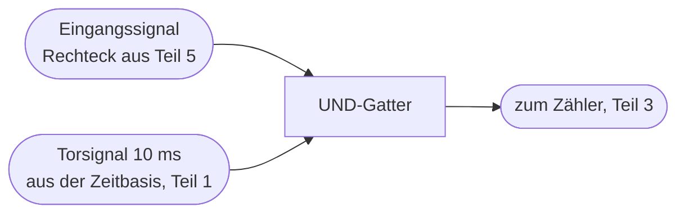

# Teil 2 – Das Tor (Gate): Signale gezielt durchlassen

!!! abstract "Ziel dieses Teils"
    Du verstehst, wie ein **logisches UND-Gatter** als „Tor" wirkt, das das
    Eingangssignal nur während der Torzeit zum Zähler durchlässt – und warum genau diese
    Torzeit die Auflösung festlegt.

## 1. Die Idee des Tors

Aus Teil 0 wissen wir: Wir müssen Schwingungen **nur während eines Zeitfensters** zählen.
Das Bauteil, das ein Signal „auf Kommando" durchlässt oder sperrt, ist ein **UND-Gatter**
(AND). Ein UND-Gatter gibt nur dann High aus, wenn **beide** Eingänge High sind:

| Signal | Tor-Steuerung | Ausgang |
|--------|---------------|---------|
| 0 | 0 | 0 |
| 1 | 0 | **0** (gesperrt) |
| 0 | 1 | 0 |
| 1 | 1 | **1** (durchgelassen) |

Legt man das **Eingangssignal** an den einen Eingang und das **Torsignal** (unser
50-Hz-Steuersignal aus Teil 1) an den anderen, dann passieren die Schwingungen nur,
solange das Torsignal High ist:

```
Eingangssignal  ┌┐┌┐┌┐┌┐┌┐┌┐┌┐┌┐┌┐┌┐┌┐┌┐   (läuft ununterbrochen)
               ─┘└┘└┘└┘└┘└┘└┘└┘└┘└┘└┘└┘└─
Torsignal       ┌───────────┐              (10 ms High = Tor offen)
               ─┘           └───────────
Zähler sieht    ┌┐┌┐┌┐┌┐┌┐┌┐             (nur diese werden gezählt!)
               ─┘└┘└┘└┘└┘└┘└───────────
```



## 2. Torzeit und Auflösung – hier wird Teil 0 konkret

Unser Torsignal ist 50 Hz, also 20 ms Periode: **10 ms High** (Tor offen) und 10 ms Low
(Tor zu, Zeit zum Anzeigen/Zurücksetzen). Die Torzeit ist somit \( T_\text{Tor}=10\,\text{ms} \).

Setzen wir das in unsere Formel ein und berücksichtigen den 10:1-Vorteiler aus Teil 3:

\[
f = \frac{N}{T_\text{Tor}} \cdot \text{Vorteilerfaktor}
= \frac{N}{10\,\text{ms}} \cdot 10 = N \cdot 1000\,\text{Hz}
\]

Jeder Zählschritt entspricht also **1 kHz** – das ist exakt die 1-kHz-Auflösung unseres
Vorbilds. Der ±1-Digit-Fehler aus Teil 0 ist damit ±1 kHz.

!!! note "Warum beim BX-020 keine 1-s-Torzeit?"
    Mit 1 s Tor hätte man 1 Hz Auflösung – viel besser. Aber: Die Zähler-ICs (4026)
    haben **keinen Zwischenspeicher**. Die Anzeige zeigt also live den laufenden
    Zählerstand. Bei 1 s Tor würde man die Ziffern 1 s lang hochlaufen sehen und dann
    kurz das Ergebnis – unbrauchbar. Bei 50 Hz Wiederholrate verschmilzt das Flimmern
    dank Augenträgheit gerade noch zu einer lesbaren Zahl. Die grobe Auflösung ist also
    der **Preis** für den Verzicht auf einen Latch. Genau diesen Zielkonflikt lösen wir
    in Teil 9 auf.

## 3. Wo ist das Tor im BX-020 „versteckt"?

Ein schönes Detail: Das BX-020 hat **kein separates UND-Gatter als Bauteil**. Die
Torfunktion ist in die Zähler-ICs **hineinverlegt**. Der 4026 besitzt einen
**Clock-Inhibit-Eingang** (Pin 2) und einen Display-Enable; über das 50-Hz-Signal an den
Pins 2/3 wird das Zählen und Anzeigen für je 10 ms freigegeben bzw. gesperrt. Funktional
ist das genau unser Tor – nur elegant in den vorhandenen Baustein integriert, was Bauteile
spart. Für das **Verständnis** denkst du es am besten als separates UND-Gatter; im realen
Aufbau (Teil 3) siehst du, wie es im 4026 aufgeht.

## 4. Simulieren

Folge dem **Aufbaurezept Teil 2** im [Anhang → Simulator-Dateien](anhang-simulation.md):
In Falstad verbindest du einen **Clock** (schnelles Eingangssignal) und einen **Logic
Input** (das Torsignal) mit einem **AND Gate**. Beobachte: Nur solange das Torsignal High
ist, erscheinen die Impulse am Ausgang. Schalte das Torsignal um und sieh zu, wie sich die
Anzahl der durchgelassenen Impulse ändert – die Torzeit-Auflösungs-Beziehung zum Anfassen.

## 5. Typische Fehler

!!! danger
    - **Torsignal und Eingang vertauscht** – funktioniert beim reinen UND zwar
      symmetrisch, aber sobald Inhibit-Logik im Spiel ist (4026, aktiv Low/High),
      kommt es auf die richtige Zuordnung an. Datenblatt beachten.
    - **Prellende/unsaubere Flanken am Torsignal** erzeugen Zählfehler genau an den
      Fenstergrenzen. Deshalb kommt das Torsignal aus der sauberen digitalen Zeitbasis,
      nicht aus einem analogen Zeitglied.

## Zusammenfassung

- Ein **UND-Gatter** wirkt als Tor: Signal passiert nur, wenn das Torsignal High ist.
- Die **Torzeit** (hier 10 ms) legt zusammen mit dem Vorteiler die Auflösung fest
  (hier 1 kHz/Digit).
- Im BX-020 ist das Tor platzsparend in die 4026-Zähler integriert (Clock-Inhibit).

## Übungsfragen

??? question "1. Das Torsignal ist 10 ms High. Ohne Vorteiler: welcher Frequenz entspricht 1 Digit?"
    \( 1 / 10\,\text{ms} = 100\,\text{Hz} \) pro Digit.

??? question "2. Warum will man eine möglichst saubere (steile, prellfreie) Torflanke?"
    Eine unsaubere Flanke verlängert/verkürzt das Fenster undefiniert und kann an der
    Grenze Impulse doppelt oder gar nicht zählen → Messfehler.

---

Weiter mit [Teil 3 – Der Zähler](teil-3-zaehler.md): Wie werden die durchgelassenen
Impulse tatsächlich gezählt – und wie kaskadiert man mehrere Ziffern?
