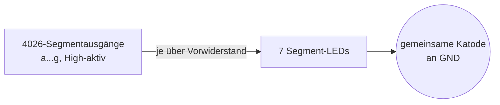

# Teil 4 – Die Anzeige: aus Zahlen werden leuchtende Ziffern

!!! abstract "Ziel dieses Teils"
    Du verstehst, wie eine **7-Segment-Anzeige** funktioniert, was „gemeinsame Katode"
    bedeutet, warum **Vorwiderstände** zwingend sind und wie der 4026-Dekoder die
    Segmente ansteuert.

## 1. Die 7-Segment-Anzeige

Eine Ziffernanzeige besteht aus **sieben Leuchtsegmenten** (plus optional einem
Dezimalpunkt), die wie eine 8 angeordnet sind. Durch gezieltes Ein-/Ausschalten
entstehen die Ziffern 0–9:

```
     aaa
    f   b
    f   b
     ggg
    e   c
    e   c
     ddd   (dp)
```

| Ziffer | leuchtende Segmente |
|--------|---------------------|
| 0 | a b c d e f |
| 1 | b c |
| 2 | a b d e g |
| 8 | a b c d e f g |

Jedes Segment ist eine **Leuchtdiode (LED)**. Eine LED leuchtet, wenn Strom in
Durchlassrichtung fließt – und sie **muss im Strom begrenzt werden**, sonst brennt sie
durch.

## 2. Gemeinsame Katode vs. gemeinsame Anode

Damit man nicht 7×5 = 35 einzelne Anschlüsse braucht, teilen sich alle Segment-LEDs einer
Ziffer **einen** gemeinsamen Anschluss:

- **Gemeinsame Katode (common cathode):** Alle Minuspole zusammen an GND. Ein Segment
  leuchtet, wenn sein Anodenpin auf **High** gelegt wird. ← **so im BX-020** (LED-Typ
  SC52-11, superrot, gemeinsame Katode).
- **Gemeinsame Anode (common anode):** Alle Pluspole zusammen an +5 V. Ein Segment
  leuchtet bei **Low** am Segmentpin.

Der 4026 liefert **High-aktive** Segmentausgänge und passt damit perfekt zur gemeinsamen
Katode.



## 3. Warum Vorwiderstände Pflicht sind

Eine LED hat eine nahezu feste **Flussspannung** (rot ≈ 1,8–2,0 V). Die restliche
Spannung muss ein Vorwiderstand „verbraten", der zugleich den Strom einstellt:

\[
R = \frac{U_\text{Versorgung} - U_\text{LED}}{I_\text{LED}}
\]

!!! example "Beispielrechnung"
    Bei \( U_\text{Versorgung}=5\,\text{V} \), \( U_\text{LED}=2\,\text{V} \) und
    gewünschten \( I_\text{LED}=10\,\text{mA} \):
    \[
    R = \frac{5\,\text{V}-2\,\text{V}}{0{,}01\,\text{A}} = 300\,\Omega.
    \]
    Ohne Widerstand flössen theoretisch Dutzende mA → die LED (und evtl. der
    Dekoder-Ausgang) würde zerstört.

!!! info "Multiplexing (Ausblick Teil 9)"
    Im BX-020 bekommt jede der fünf Ziffern ihren eigenen Dekoder (4026) – einfach, aber
    5 ICs. Fortgeschrittene Zähler wie der Elektor-NF-Zähler (74C925) zeigen immer nur
    **eine** Ziffer gleichzeitig, wechseln aber so schnell durch, dass das Auge alle
    sieht (**Multiplexing**). Das spart Bauteile und Anschlüsse – dazu mehr in Teil 9.

## 4. Der Dezimalpunkt

Damit man z. B. „14,500 MHz" statt „14500 kHz" ablesen kann, wird ein **Dezimalpunkt**
gesetzt. Im BX-020 steuert ihn ein eigener Transistor, dessen Vorwiderstand (R8,
1,0–1,5 kΩ) die Helligkeit bestimmt. Das ist reine Komfortfunktion und für das
Zählprinzip nicht nötig.

## 5. Simulieren

Folge dem **Aufbaurezept Teil 4** im [Anhang → Simulator-Dateien](anhang-simulation.md):
In Falstad verbindest du einen **Counter** über einen **7-Segment-Decoder** mit einer
**7-Segment-LED**. So siehst du die Ziffern 0–9 hochzählen. Wer die Strombegrenzung
studieren will, baut ein einzelnes LED-Segment mit Vorwiderstand nach der Formel aus
Abschnitt 3 nach.

## 6. Typische Fehler

!!! danger
    - **Vorwiderstände vergessen** → LED und/oder Dekoderausgang zerstört.
    - **Falscher Anzeigetyp** (Anode statt Katode) → nichts leuchtet oder invertiert.
    - **Zu großer Vorwiderstand** → Anzeige zu dunkel, bei Multiplex kaum ablesbar.

## Zusammenfassung

- Eine **7-Segment-Anzeige** stellt Ziffern aus 7 LED-Segmenten dar.
- **Gemeinsame Katode** + High-aktiver 4026-Ausgang passen zusammen (so im BX-020).
- **Vorwiderstände** sind Pflicht; \( R=(U_\text{Vers}-U_\text{LED})/I_\text{LED} \).
- **Multiplexing** spart Bauteile und ist das Thema von Teil 9.

## Übungsfragen

??? question "1. Wie groß muss R bei 5 V, 2 V LED-Fluss und 8 mA sein?"
    \( R=(5-2)/0{,}008 = 375\,\Omega \), praktisch der nächste Normwert (390 Ω).

??? question "2. Welche Segmente leuchten bei der Ziffer 7?"
    a, b, c.

??? question "3. Warum passt eine High-aktive Dekoderausgabe zur gemeinsamen Katode?"
    Gemeinsame Katode liegt an GND; ein Segment leuchtet bei High an der Anode – genau
    das liefert der 4026.

---

Weiter mit [Teil 5 – Eingangsstufe](teil-5-eingangsstufe.md): Woher kommt eigentlich das
saubere Rechtecksignal, das wir zählen? Echte Messsignale sind oft klein und
„verschliffen".
