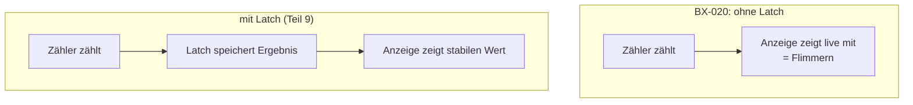

# Teil 6 – Steuerung & Timing: der Rhythmus des Zählers

!!! abstract "Ziel dieses Teils"
    Du verstehst den vollständigen **Ablaufzyklus** (messen → anzeigen → zurücksetzen),
    wie aus dem 50-Hz-Signal mit einem **Differenzierglied** ein schmaler **Reset-Impuls**
    wird, und – der didaktische Höhepunkt – **warum die Anzeige flimmert und zu niedrig
    zählt**, weil ein Zwischenspeicher (Latch) fehlt.

## 1. Der Messzyklus im Takt von 50 Hz

Die Zeitbasis (Teil 1) liefert ein 50-Hz-Signal, Periode **20 ms**. Dieser Takt gibt den
kompletten Rhythmus vor:

```
|<----------- 20 ms (eine Periode) ----------->|
| 10 ms Tor OFFEN        | 10 ms Tor ZU         |
| zählen + anzeigen      | anzeigen             |
                          ↑ kurz davor/danach: Reset-Impuls
```


Konkret im BX-020:

- Das \( Q \)-Signal des letzten Teiler-Flipflops (Teil 1) geht an Clock-Inhibit/Display
  der 4026 (Pins 2/3) und gibt **10 ms zählen** frei.
- Aus dem **invertierten** 50-Hz-Signal (\( \bar Q \)) wird alle 20 ms ein **schmaler
  Reset-Impuls** gebildet, der alle fünf Dekaden auf 0 setzt, bevor die nächste Messung
  beginnt.

## 2. Der Reset-Impuls: ein Differenzierglied (C3/R3)

Für den Reset brauchen wir keinen langen Pegel, sondern einen **kurzen Nadelimpuls** genau
an der Flanke. Das erzeugt ein **RC-Differenzierglied** aus Kondensator C3 (220 pF) und
Widerstand R3 (10 kΩ):

- Ein Kondensator lässt nur **Änderungen** durch. An einer Signalflanke entsteht kurz ein
  Spannungssprung über R3 – danach „lädt sich der Impuls weg".
- Die Dauer bestimmt die Zeitkonstante \( \tau = R \cdot C \):

\[
\tau = R_3 \cdot C_3 = 10\,\text{k}\Omega \cdot 220\,\text{pF} = 2{,}2\,\mu\text{s}
\]

```
Flankensignal     ──┐           ┌──
                    └───────────┘
nach C3/R3 (Reset)  ┌┐                  ← nur ein ~2,2 µs schmaler Impuls
                  ──┘└───────────────
```

Diese 2,2 µs sind bewusst **sehr kurz** gegenüber der 10-ms-Zählzeit, damit der Reset
möglichst wenig von der Messung „wegfrisst".

## 3. Warum der Zähler systematisch zu niedrig zählt

Jetzt wird ein feiner, aber lehrreicher Effekt sichtbar. Der Reset-Impuls wird **von der
Zählzeit abgezogen** – während der ~2,2 µs Reset kann nicht gezählt werden. Bei niedrigen
Frequenzen ist das vernachlässigbar, aber je höher die Frequenz, desto mehr Impulse gehen
in dieser kurzen Totzeit verloren. Deshalb zeigt der BX-020 **immer etwas zu wenig** an
(laut Doku −1 Digit bis 20 MHz, darüber −2 bis −3 Digit).

!!! info "Der Trick mit der Lastkapazität"
    Der Entwickler gleicht das teilweise aus, indem er die Quarz-Lastkapazität von 32 pF
    auf ~50 pF erhöht (Teil 1). Dadurch läuft der Quarz minimal langsamer, die Torzeit
    wird minimal länger und kompensiert einen Teil der Zählverluste. Ein schönes Beispiel
    dafür, wie man einen systematischen Fehler mit einem zweiten kleinen „Gegenfehler"
    ausgleicht.

## 4. Der didaktische Höhepunkt: Warum flimmert die Anzeige?

Die 4026-Zähler haben **keinen Zwischenspeicher (Latch)**. Konsequenz: Die Anzeige zeigt
**immer den aktuellen Zählerstand** – auch **während** gezählt wird. Der Ablauf pro 20 ms:

1. Reset → Anzeige springt auf 0.
2. 10 ms zählen → die Ziffern **laufen sichtbar hoch**.
3. Kurz steht das Endergebnis, dann beginnt alles von vorn.

Das Auge sieht also 50-mal pro Sekunde ein „Hochzählen und Zurückspringen". Dank
**Augenträgheit** verschwimmt das bei 50 Hz gerade noch zu einer lesbaren Zahl – es
flimmert aber sichtbar, und man liest im Grunde nur den Endwert.

!!! warning "Der Kernkonflikt – und warum man die Torzeit NICHT einfach verlängert"
    Man könnte die Auflösung verbessern, indem man die Torzeit verlängert (Teil 2). Aber
    ohne Latch würde eine längere Torzeit die Anzeige **noch stärker flimmern** lassen
    (langsameres Hochzählen, selteneres Aktualisieren) – unlesbar. Bei 50 Hz ist das
    Limit erreicht. **Mehr Auflösung geht nur mit einem anderen Prinzip: einem Latch**,
    der das fertige Ergebnis festhält, während der Zähler schon die nächste Messung macht.
    Genau das macht der 74C925 im Elektor-Zähler → **Teil 9**.



## 5. Simulieren

Zwei Teile:

- **Reset-Impuls (fertige Datei):** Lade `sim/falstad/teil6-reset.txt` in
  [Falstad](https://www.falstad.com/circuit/) (*Datei → Import aus Text*). Ein Rechteck
  über 220 pF auf 10 kΩ erzeugt an jeder Flanke den schmalen Reset-Nadelimpuls (τ ≈ 2,2 µs)
  – das Differenzierglied C3/R3 zum Anschauen.
- **Latch-Vergleich (Rezept):** Folge dem **Aufbaurezept Teil 6** im
  [Anhang](anhang-simulation.md): ein Zähler einmal direkt an der Anzeige (zappelt) und
  einmal über einen **Latch** (steht ruhig). Schalte um und beobachte den Unterschied.

## 6. Typische Fehler

!!! danger
    - **Reset-Impuls zu breit** (zu großes R·C) → frisst zu viel Zählzeit, Anzeige zählt
      stark zu niedrig.
    - **Reset fehlt** → Zähler addiert über Messzyklen hinweg, Werte laufen davon.
    - **Tor- und Reset-Timing überlappen falsch** → Ergebnis wird gelöscht, bevor es
      sichtbar ist.

## Zusammenfassung

- Der **50-Hz-Takt** gibt den Zyklus vor: 10 ms zählen/anzeigen, dazwischen ein kurzer
  **Reset**.
- Ein **RC-Differenzierglied** (C3/R3, τ≈2,2 µs) erzeugt den schmalen Reset-Impuls.
- Die Reset-Totzeit lässt den Zähler **systematisch zu niedrig** zählen (frequenzabhängig).
- **Ohne Latch** flimmert die Anzeige und die Torzeit kann nicht verlängert werden → das
  ist der Grund für die begrenzte Auflösung und die Brücke zu **Teil 9**.

## Übungsfragen

??? question "1. Wie lang ist der Reset-Impuls bei R3=10 kΩ, C3=220 pF?"
    \( \tau = 10\,\text{k}\Omega \cdot 220\,\text{pF} = 2{,}2\,\mu\text{s} \).

??? question "2. Warum zählt der BX-020 bei hohen Frequenzen mehr zu niedrig als bei niedrigen?"
    Die Reset-Totzeit ist fest; je höher die Frequenz, desto mehr Impulse fallen in diese
    Totzeit und gehen verloren.

??? question "3. Warum verbessert ein Latch die Lesbarkeit und erlaubt längere Torzeiten?"
    Der Latch hält das fertige Ergebnis fest, während der Zähler neu zählt. Die Anzeige
    steht ruhig, unabhängig davon, wie lange gezählt wird – kein Flimmern mehr.

---

Weiter mit [Teil 7 – Stromversorgung](teil-7-stromversorgung.md): Alles braucht saubere
5 V – wie erzeugt und stabilisiert man sie?
