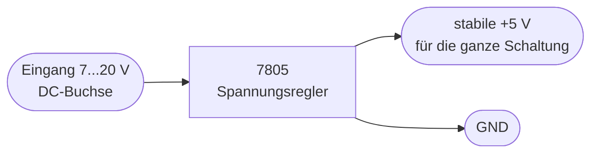

# Teil 7 – Die Stromversorgung: saubere, stabile 5 Volt

!!! abstract "Ziel dieses Teils"
    Du verstehst, warum die ganze Schaltung eine **stabile** Spannung braucht, wie ein
    **Festspannungsregler (7805)** sie erzeugt, welche Rolle **Abblockkondensatoren**
    spielen und welche Sicherheitshinweise (Verpolung!) gelten.

## 1. Warum eine geregelte Spannung?

Alle Logik-ICs (74HC-Serie, 4026) arbeiten mit **5 V**. Weicht die Spannung ab, droht:

- zu **wenig** Spannung → ICs arbeiten unzuverlässig, Zähler verzählt sich;
- zu **viel** Spannung → ICs werden zerstört.

Eine Batterie oder ein Steckernetzteil liefert aber selten exakt 5 V und schwankt unter
Last. Deshalb braucht es einen **Spannungsregler**, der aus einer höheren, schwankenden
Eingangsspannung konstante 5 V macht.

## 2. Der Festspannungsregler 7805

Der **7805** ist ein Linearregler, der aus **7–20 V** am Eingang stabile **5,0 V** am
Ausgang erzeugt. Drei Anschlüsse: Eingang, Masse, Ausgang. Die überschüssige Spannung
„verbrät" er als Wärme.

Technische Daten laut BX-020:

- Betrieb mit **5 V direkt** (dann 7805 überbrücken/weglassen) **oder** 7–20 V über den Regler.
- **Stromaufnahme max. 65 mA** – sehr genügsam.
- Läuft sogar mit **4 NiMH-Zellen (4,8 V)** direkt, ohne Regler.

!!! tip "Wärme im Blick behalten"
    Je höher die Eingangsspannung, desto mehr Leistung verheizt der 7805:
    \( P = (U_\text{ein}-5\,\text{V}) \cdot I \). Bei 20 V und 65 mA sind das ~1 W – ein
    kleiner Kühlkörper schadet dann nicht. Bei 7–9 V bleibt alles handwarm.

## 3. Abblockkondensatoren – die „Energiepuffer"

Digital-ICs ziehen bei jedem Schaltvorgang **kurze Stromspitzen**. Ohne Puffer würde die
Versorgungsspannung dabei kurz einbrechen und Nachbarstufen stören. Abhilfe:

- Ein **100-nF-Keramikkondensator** möglichst nah an jedem IC („Abblocken") liefert die
  schnelle Stromspitze lokal.
- Ein **Elko (47 µF)** an den Enden der Versorgungsschiene glättet langsamere Schwankungen.

Die BX-020-Doku sagt es klar: „Ein Elko und ein 100-nF-Abblock-Kondensator befinden sich
jeweils an den beiden Enden der Plus-Schiene, damit werden unerwünschte Koppeleffekte
zwischen den Stufen vermieden."

## 4. Sicherheit: Verpolung!

!!! danger "Kein Verpolungsschutz auf der Platine!"
    Die BX-020-Hauptplatine enthält **keine Schutzdiode**. Legt man die
    Versorgungsspannung **falsch herum** an, können ICs sofort zerstört werden. Deshalb:
    **Polarität vor dem Einschalten zweimal prüfen.** Wer auf Nummer sicher gehen will,
    setzt eine Verpolungsschutz-Diode (z. B. in Reihe eine Schottky- oder als
    Brücken-/Shunt-Variante) vor den Regler – ein sinnvoller Zusatz für Einsteiger.

Weitere Punkte:

- Bei Direktbetrieb mit 5 V die Spannung **genau einhalten** (nicht 6 V „weil gerade da").
- Elkos **richtig gepolt** einlöten (Minus-Markierung beachten).

## 5. Simulieren

Lade `sim/falstad/teil7-netzteil.txt` in [Falstad](https://www.falstad.com/circuit/)
(*Datei → Import aus Text*). Du siehst eine **pulsierende Eingangsspannung** (0…10 V),
einen Serienwiderstand als Quellimpedanz, den **Glättungskondensator** und eine Last.
Beobachte, wie der Kondensator die Spannung stützt und die Welligkeit glättet. Vergrößere/
verkleinere den Kondensator (Rechtsklick → Edit) und sieh, wie sich die Restwelligkeit
ändert – genau das leisten Elko und Abblock-Kondensatoren im echten Gerät.

## 6. Messen

- **Ausgangsspannung des 7805** gegen GND messen → muss **5,0 V** sein, bevor irgendein
  anderer Test gemacht wird. Falsche Versorgung ist die häufigste Ursache für „gar nichts
  geht".
- Stromaufnahme (Multimeter in Reihe) → sollte grob im Bereich einiger zehn mA liegen;
  deutlich mehr deutet auf einen Kurzschluss/Fehler hin.

## 7. Typische Fehler

!!! danger
    - **Verpolung** → sofortige IC-Zerstörung (keine Schutzdiode!).
    - **Elko falsch gepolt** → kann aufplatzen.
    - **Kein Abblockkondensator an den ICs** → sporadische Zählfehler, schwer zu finden.
    - **7805 ohne Kühlung bei hoher Eingangsspannung** → Überhitzung/Abschaltung.

## Zusammenfassung

- Logik braucht **stabile 5 V**; der **7805** macht sie aus 7–20 V.
- **Abblock-Kondensatoren** (100 nF je IC) + **Elko** (47 µF) puffern Stromspitzen.
- **Verpolung vermeiden** – die Platine hat keinen Schutz.
- Erste Inbetriebnahme-Regel: **zuerst die 5 V messen.**

## Übungsfragen

??? question "1. Wie viel Leistung verheizt der 7805 bei 12 V Eingang und 60 mA?"
    \( P=(12-5)\cdot0{,}06 = 0{,}42\,\text{W} \).

??? question "2. Wozu der 100-nF-Kondensator direkt am IC?"
    Er liefert die schnellen Schalt-Stromspitzen lokal und verhindert Spannungseinbrüche,
    die Nachbarstufen stören würden.

??? question "3. Was ist der allererste Messschritt bei der Inbetriebnahme?"
    Die 5-V-Versorgungsspannung am Reglerausgang prüfen.

---

Weiter mit [Teil 8 – Integration & Inbetriebnahme](teil-8-integration.md): Jetzt fügen wir
alle Baugruppen zusammen und nehmen den Zähler systematisch in Betrieb.
