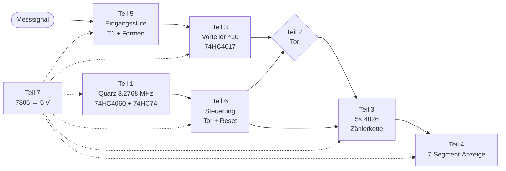
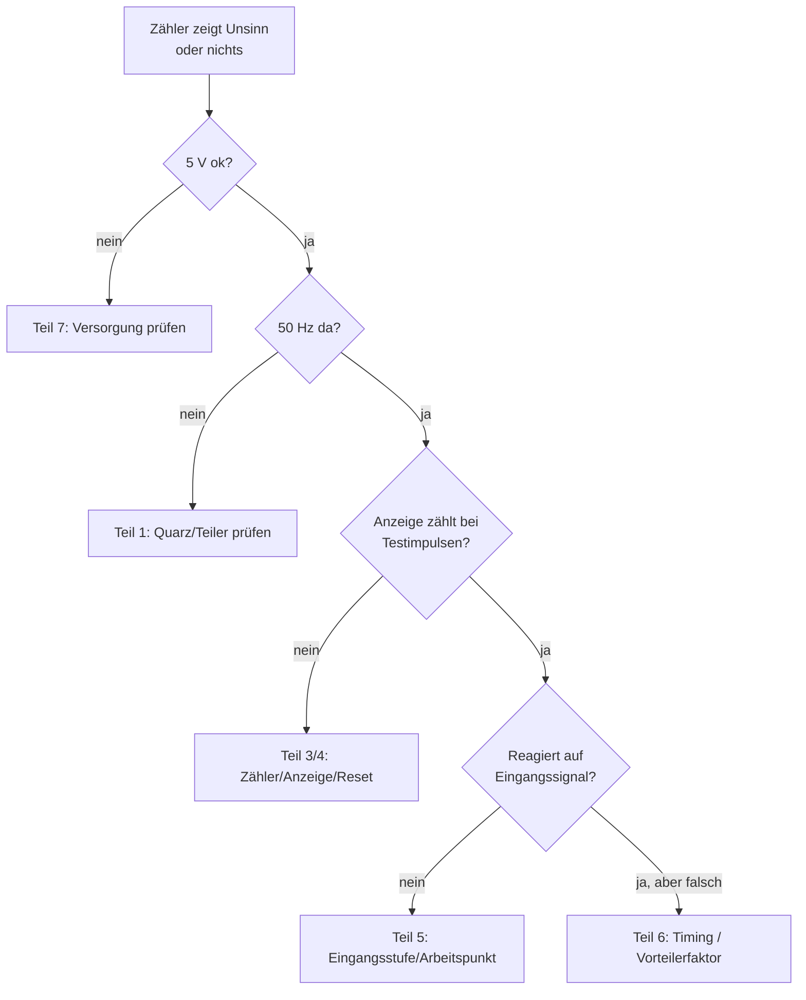

# Teil 8 – Integration & Inbetriebnahme: alle Baugruppen zusammenfügen

!!! abstract "Ziel dieses Teils"
    Du führst alle Baugruppen zum kompletten Zähler zusammen und nimmst ihn
    **systematisch** in Betrieb – mit einer Reihenfolge und einer Mess-Checkliste, die
    Fehlersuche zum geführten Prozess statt zum Ratespiel macht.

## 1. Das vollständige Blockschaltbild

Jetzt fügt sich alles zusammen, was wir einzeln verstanden haben:

## 2. Aufbaustrategie: Block für Block, nicht alles auf einmal

!!! tip "Die goldene Regel der Inbetriebnahme"
    Baue und **teste jede Baugruppe einzeln**, in dieser Reihenfolge. So weißt du bei
    einem Fehler immer, in welchem Block er steckt – es ist immer der zuletzt
    hinzugefügte.

1. **Stromversorgung (Teil 7)** zuerst. → Miss 5,0 V. Nichts anderes anschließen, bevor
   das stimmt.
2. **Zeitbasis (Teil 1)**. → Miss 50 Hz am Ausgang von IC2b. Läuft der Quarz?
3. **Anzeige + Zählerkette (Teil 3/4)**. → Reset von Hand auslösen, Testimpulse geben,
   Ziffern müssen sauber hochzählen und kaskadieren.
4. **Steuerung/Timing (Teil 6)**. → Tor- und Reset-Signal prüfen; Zähler soll im
   50-Hz-Rhythmus zählen und zurücksetzen.
5. **Vorteiler + Eingangsstufe (Teil 3/5)** zuletzt. → Kollektorspannung T1 ~1,8 V,
   dann echtes Signal anlegen.

## 3. Lötaufbau: Tipps aus der BX-020-Anleitung

!!! note "Reihenfolge beim Bestücken"
    - **Niedrige Bauteile zuerst** (Widerstände, Diode), dann höhere (ICs, Elkos, Quarz).
    - **ICs:** zuerst zwei diagonale Beine anlöten, Lage kontrollieren, dann den Rest.
      **Pin 1 / Markierung** genau beachten – falsch eingelötete ICs sind kaum zu retten.
    - **Elkos** richtig gepolt einlöten.
    - **Quarz** ~1 mm **über** der Platine montieren (sonst Kurzschluss der Lötaugen!).
    - Saubere, glänzende Lötstellen; auf **Lötbrücken** prüfen (Lupe nehmen).

## 4. Die Inbetriebnahme-Checkliste

| Schritt | Messung | Sollwert | Wenn falsch → |
|---------|---------|----------|---------------|
| 1 | 7805-Ausgang gegen GND | 5,0 V | Verpolung? 7805? Kurzschluss? → Teil 7 |
| 2 | Ausgang IC2b (Frequenz) | 50 Hz | Quarz, Lastkondensatoren, S/R-Pins → Teil 1 |
| 3 | Reset-Leitung | schmale Impulse alle 20 ms | C3/R3, Timing → Teil 6 |
| 4 | Anzeige bei Testimpulsen | zählt sauber hoch, kaskadiert | Carry-Verdrahtung, Vorwiderstände → Teil 3/4 |
| 5 | Kollektor T1 gegen GND | ~1,8 ± 0,3 V | Arbeitspunkt, R6/R7 → Teil 5 |
| 6 | bekannte Frequenz anlegen | korrekte Anzeige (−1 Digit) | Vorteiler, Empfindlichkeit → Teil 3/5 |

## 5. Systematische Fehlersuche

!!! warning "Erwartungshaltung kalibrieren"
    Denk an Teil 6: Der BX-020 zählt **prinzipbedingt** leicht zu niedrig (−1 bis
    −3 Digit, je nach Frequenz) und hat **1 kHz Auflösung**. Eine Anzeige von „14499"
    statt „14500" kHz ist also **kein Defekt**, sondern erwartetes Verhalten. Erst
    größere Abweichungen deuten auf echte Fehler.

## 6. Abnahme: „Würde ein erfahrener Entwickler das abnehmen?"

- Bekannte Referenzfrequenzen (z. B. aus einem Signalgenerator) anlegen und die
  Anzeige gegen die Erwartungstabelle aus der BX-020-Doku vergleichen.
- Empfindlichkeit prüfen: Ab welcher Eingangsspannung spricht der Zähler bei 1 / 10 /
  30 MHz an? Vergleich mit der Empfindlichkeitstabelle.
- Thermik: Wird der 7805 bei deiner Eingangsspannung zu heiß?

## Zusammenfassung

- **Blockweise** aufbauen und testen – Fehler ist immer der zuletzt ergänzte Block.
- Feste **Inbetriebnahme-Reihenfolge**: Versorgung → Zeitbasis → Anzeige/Zähler →
  Steuerung → Eingang.
- **Mess-Checkliste** und **Fehlersuch-Baum** führen gezielt zum Fehler.
- Systematische **−1-Digit-Abweichung** und 1 kHz Auflösung sind **normal**, kein Defekt.

## Übungsfragen

??? question "1. Die Anzeige bleibt dunkel. Was misst du zuerst?"
    Die 5-V-Versorgung am 7805-Ausgang. Ohne korrekte Versorgung ist jede weitere Suche
    sinnlos.

??? question "2. 5 V sind da, aber die Anzeige zählt gar nicht. Nächster Verdacht?"
    Die Zeitbasis (50 Hz vorhanden?) bzw. der Reset. Ohne Takt/Reset passiert nichts
    Sinnvolles.

??? question "3. Der Zähler zeigt 29 999 statt 30 002 kHz. Defekt?"
    Nein – das ist die erwartete −3-Digit-Abweichung bei ~30 MHz plus 1-kHz-Auflösung.

---

Weiter mit [Teil 9 – Weiterführung](teil-9-weiterfuehrung.md): Wie macht man aus diesem
Lern-Zähler ein „erwachsenes" Gerät – mit stabiler Anzeige und besserer Auflösung?
