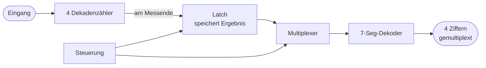

# Teil 9 – Weiterführung: vom Lern-Zähler zum „erwachsenen" Gerät

!!! abstract "Ziel dieses Teils"
    Du lernst, wie man die zwei großen Schwächen des BX-020 (flimmernde Anzeige, grobe
    Auflösung) löst: mit **Latch + Multiplex** (74C925, Elektor-Vorbild), mit **längeren
    Torzeiten**, mit **Reziprok-Messung** für niedrige Frequenzen und – als Ausblick – mit
    einem **Mikrocontroller**.

## 1. Rückblick: die zwei Schwächen und ihre gemeinsame Ursache

Aus Teil 2 und 6 wissen wir: Beide Schwächen stammen aus **einer** Designentscheidung –
dem **fehlenden Zwischenspeicher (Latch)** der 4026:

- Die Anzeige zeigt live mit → **Flimmern**.
- Die Torzeit kann deshalb nicht verlängert werden → **grobe Auflösung (1 kHz)**.

Löst man das Latch-Problem, fallen beide Schwächen zugleich.

## 2. Lösung 1: Latch + Multiplex (der 74C925)

Der Elektor-NF-Zähler zeigt die klassische Lösung. Der **74C925** vereint in **einem** IC:

- **vier Dekadenzähler**,
- einen **Zwischenspeicher (Latch)**,
- einen **Multiplexer**,
- einen **7-Segment-Dekoder**.

**Was der Latch bringt:** Am Ende jeder Messung wird das Ergebnis **einmal** in den Latch
übernommen. Die Anzeige zeigt diesen festen Wert, **während der Zähler schon die nächste
Messung** durchführt. Ergebnis: **absolut ruhige Anzeige** – und die Torzeit darf jetzt
beliebig lang sein, ohne zu flimmern. Damit ist der Weg zu **besserer Auflösung** frei.

**Was der Multiplexer bringt:** Statt 4 vollständiger Dekoder zeigt der 74C925 die Ziffern
**nacheinander** sehr schnell (über Transistoren T1–T4, die reihum je eine Stelle
aktivieren). Das Auge sieht dank Trägheit alle vier gleichzeitig. Das spart Bauteile und
Leitungen – der Preis des BX-020 (5 volle Dekoder-ICs) entfällt.

!!! info "Zeitbasis beim Elektor-Zähler"
    Dort erzeugt ein integrierter Taktgenerator (**Seiko-Epson SPG8650B**) die Zeitbasis –
    bequemer als eine diskrete Teilerkette und ohne Abgleich. Funktional ist es dasselbe
    wie unsere 74HC4060/74HC74-Kette aus Teil 1, nur in einem Baustein.

## 3. Lösung 2: höhere Auflösung durch längere Torzeit

Mit Latch kostet eine längere Torzeit keine Lesbarkeit mehr. Erinnere dich an die
Auflösungsformel aus Teil 0:

\[
\text{Auflösung} = \frac{1}{T_\text{Tor}}
\]

| Torzeit | Auflösung | Anzeige aktualisiert |
|---------|-----------|----------------------|
| 10 ms (BX-020) | 1 kHz (mit Vorteiler) | 50×/s, flimmert |
| 100 ms | 10 Hz | 10×/s, mit Latch ruhig |
| 1 s | 1 Hz | 1×/s, mit Latch ruhig |

Ein Latch ist also die **Voraussetzung** dafür, dass die schöne „Torzeit-gegen-Auflösung"-
Stellschraube überhaupt nutzbar wird.

## 4. Lösung 3: Reziprok-Messung für niedrige Frequenzen

Für **niedrige** Frequenzen bleibt die direkte Zählung schlecht (Teil 0: 50 Hz mit 1 s Tor
= nur 50 Counts = 2 % Fehler). Die Lösung ist, das Prinzip umzudrehen:

- **Direkt (hohe f):** Zähle Signalschwingungen während einer festen Torzeit.
- **Reziprok (niedrige f):** Miss die **Dauer einer (oder mehrerer) Signalperioden**, indem
  du einen **schnellen Referenztakt** zählst, und rechne \( f = 1/T \).

!!! example "Warum das bei niedrigen Frequenzen so viel besser ist"
    Bei 50 Hz dauert eine Periode 20 ms. Zählt man in dieser Zeit einen 1-MHz-Referenztakt,
    bekommt man \( 20\,\text{ms} \cdot 1\,\text{MHz} = 20\,000 \) Counts – statt 50. Die
    relative Auflösung ist damit **400-mal besser**. Genau deshalb nutzt der Elektor-
    NF-Zähler ein auf niedrige Frequenzen optimiertes Konzept.

Viele moderne Zähler messen **reziprok über die ganze Bandbreite** („reciprocal counting")
und erreichen so konstante relative Auflösung bei jeder Frequenz.

## 5. Ausblick: die Mikrocontroller-Variante

Heute würde man einen Frequenzzähler meist mit einem **Mikrocontroller** (z. B. ATmega/
Arduino, RP2040, STM32) bauen:

- Der µC hat eingebaute **Hardware-Zähler/Timer** – Tor, Zähler und Zeitbasis stecken im
  Chip.
- Er kann **direkt und reziprok** messen und je nach Frequenz automatisch umschalten.
- Er rechnet das Ergebnis, setzt den Dezimalpunkt, treibt ein LCD/OLED – **ganz ohne**
  4026/74C925.
- Oft genügt ein externer Vorteiler-IC für die ganz hohen Frequenzen.

!!! note "Warum trotzdem erst der diskrete Aufbau?"
    Beim µC verschwindet die gesamte Logik **unsichtbar** in Software und Peripherie. Du
    hast mit dem BX-020 jeden einzelnen Block **real verstanden** – Zeitbasis, Tor, Zähler,
    Dekoder, Latch. Dieses Verständnis ist genau das, was du brauchst, um die
    µC-Timer-Register später richtig zu konfigurieren. Der diskrete Zähler ist das bessere
    **Lehrstück**, der µC die bessere **Produktionslösung**.

## 6. Gegenüberstellung

| Merkmal | BX-020 (unser Lern-Zähler) | 74C925 (Elektor) | µC-Variante |
|---------|----------------------------|------------------|-------------|
| Anzeige | flimmert (kein Latch) | ruhig (Latch) | ruhig |
| Dekoder | 5× 4026 | 1× 74C925 (Mux) | Software |
| Auflösung | 1 kHz | feiner möglich | frei wählbar |
| niedrige f | schlecht | besser (NF-optimiert) | ideal (reziprok) |
| Lernwert | **sehr hoch** | hoch | gering (viel „Magie") |
| Bauteile | wenige, sichtbar | wenige, integriert | minimal |

## Zusammenfassung

- Beide BX-020-Schwächen haben **eine** Ursache: der fehlende **Latch**.
- Der **74C925** löst das mit **Latch + Multiplex** → ruhige Anzeige, freie Torzeit.
- **Längere Torzeit** verbessert die Auflösung – erst mit Latch praktikabel.
- **Reziprok-Messung** macht niedrige Frequenzen genau.
- Die **µC-Variante** ist die moderne Produktionslösung – aber der diskrete Aufbau ist
  das bessere Lehrstück.

## Übungsfragen

??? question "1. Welche eine Designentscheidung verursacht beim BX-020 sowohl Flimmern als auch grobe Auflösung?"
    Der fehlende Zwischenspeicher (Latch) in den 4026.

??? question "2. Wie viele Referenztakt-Impulse zählt man bei reziproker Messung einer 100-Hz-Periode mit 1-MHz-Referenz?"
    Eine Periode = 10 ms; \( 10\,\text{ms}\cdot1\,\text{MHz}=10\,000 \) Counts.

??? question "3. Warum lohnt der diskrete Aufbau trotz µC-Alternative?"
    Weil man jeden Funktionsblock real versteht – dieses Verständnis braucht man auch, um
    die Timer-Hardware eines µC korrekt zu nutzen.

---

**Geschafft!** Du hast einen Frequenzzähler von der Definition der Frequenz bis zur
„erwachsenen" Variante durchdrungen. Im [Anhang](anhang-bom.md) findest du die
Bauteilliste, die Simulator-Dateien und ein Glossar.
